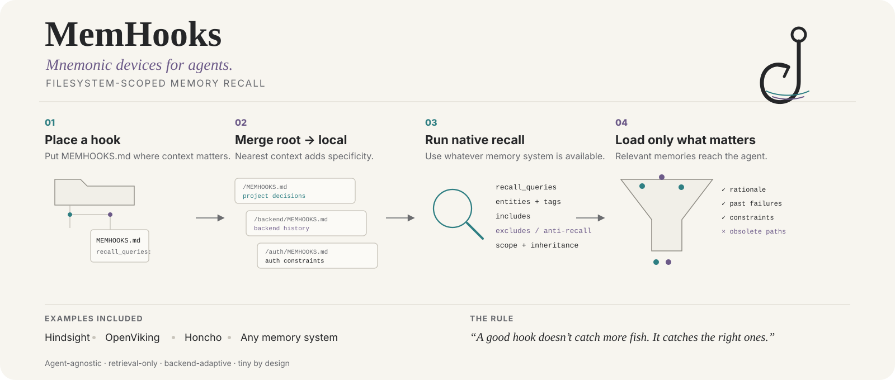

<p align="center">
  
</p>

<h1 align="center">MemHooks</h1>
<p align="center"><strong>Mnemonic devices for agents.</strong></p>
<p align="center">Filesystem-scoped memory recall · <em>Hook the right memories into the right context.</em> 🎣</p>

<p align="center">
  
  
  
  
  
</p>

<p align="center">
  
</p>

## The idea

> **You can't recall what you don't know you know.**

An agent can have the right memory stored perfectly and still fail to use it, because retrieval begins with a cue. If the agent no longer remembers that an old decision, failure, workaround, constraint, or insight even exists, it may never formulate the search that would bring that memory back.

That is the gap MemHooks is meant to fill. It stores the **cue to remember**, close to the code or folder where that cue matters.

Your agent may already **have** the right memory. The failure is often simpler: it never realizes that *this folder* is where that memory matters.

MemHooks fixes that with tiny, directory-scoped `MEMHOOKS.md` files.

> **Memory systems know how to remember. MemHooks tells the agent what to recall here.**

A MemHook contains retrieval routing — specific recall questions, entities, tags, useful stable summaries, and even things that should **not** be recalled. Before substantive work, the agent walks from the workspace root to the active directory, merges the applicable hooks, adapts them to whatever memory system is available, performs bounded recall, and then gets on with the job.

```text
workspace/
├── MEMHOOKS.md
├── backend/
│   ├── MEMHOOKS.md
│   └── auth/
│       ├── MEMHOOKS.md
│       └── refresh.py
```

Working in `backend/auth/` means:

```text
root hook
   ↓ inherit
backend hook
   ↓ inherit
local auth hook
   ↓
translate to current memory backend
   ↓
recall the exact context that matters
   ↓
do the work
```

## Why it exists

Long-term memory does not automatically imply good recall. Semantic similarity alone can miss old architectural decisions, rejected approaches, weird platform gotchas, or the reason some apparently ridiculous line of code exists.

A folder is already a strong contextual cue. MemHooks makes that cue explicit.

- **Filesystem-scoped** — context follows the part of the project being touched.
- **Inherited** — broad project knowledge at the root, increasingly specific hooks deeper down.
- **Agent-agnostic** — the skill describes the behavior, not one specific harness.
- **Memory-agnostic** — examples are provided for Hindsight, OpenViking and Honcho; an LLM can infer the equivalent operations for another backend.
- **Retrieval-only** — MemHooks does not create, rewrite, consolidate or delete memories.
- **Anti-recall too** — `exclude` lets you keep obsolete but semantically tempting memories out of working context.
- **Cheap by design** — small files, bounded retrieval, no database or daemon of its own.

## A minimal hook

```md
---
schema: memhooks/v1
inherits: true

recall_queries:
  - "Why is this authentication subsystem designed this way?"
  - "What previous failures or rejected fixes involved refresh-token rotation?"

entities:
  - authentication
  - refresh token

exclude:
  - obsolete OAuth prototype
---

Use direct recall first. Use deeper memory reasoning only if the retrieved
facts disagree or the rationale is still unclear.
```

That file contains **no memory itself**. It tells the agent which memories are worth retrieving before it touches this subtree.

## Who fills `MEMHOOKS.md`?

A hook that never changes would eventually become useless, so MemHooks includes a **zero-LLM maintainer**. The default design deliberately does **not** run a second model after every session.

There are two maintenance paths:

1. **Deterministic auto-anchors — zero model tokens.** The included `scripts/memhooks_update.py` can run on a runtime's `post_tool_call` event. It inspects the files touched by the tool call and creates/refreshes a small machine-managed block in the relevant directory's `MEMHOOKS.md`. That block says, in effect: *when working here later, recall the decisions, constraints, failures, fixes, rejected approaches and unresolved issues involving these files.*
2. **Same-turn semantic cues — no extra LLM call.** If the current agent has just discovered a non-obvious architectural decision, failure mode, constraint, or rejected approach, it can call the same script's `note` command while it is already reasoning. That adds one concise **future retrieval question**, not the answer itself.

Example:

```bash
python3 memhooks_update.py note \
  --cwd "$PWD" \
  --query "Why was refresh-token rotation split into two stages, and what alternatives were rejected?"
```

The important distinction is:

> **The memory backend stores what happened. MemHooks stores the cue that tells a future agent there is something worth recalling.**

The deterministic writer guarantees that active code areas acquire recall anchors even if the model never thinks about MemHooks. Semantic notes make those anchors sharper, but they piggyback on the model call that is already happening instead of paying for a separate summarization pass.

MemHooks only auto-maintains its **routing metadata**. It still does not create, rewrite, consolidate, or delete memories in Hindsight/OpenViking/Honcho/etc.

## How the skill adapts

MemHooks ships with worked examples rather than a giant adapter framework:

| Memory system | Typical mapping |
|---|---|
| **Hindsight** | `recall` for concrete history; `reflect` when synthesis is actually needed; use entities/fact types where available |
| **OpenViking** | search the `viking://` context hierarchy, then progressively read only the needed detail |
| **Honcho** | semantic search/context for concrete memory; dialectic reasoning only when synthesis is needed |
| **Anything else** | inspect the available memory tools, use the bundled mappings as examples, and infer the closest native operations |

> **Do not require a bespoke MemHooks plugin for every memory system. A capable agent should adapt the retrieval intent to the tools it actually has.**

See [`references/memory-systems/`](references/memory-systems/) for the mappings.

## Runtime hook support

The **MemHooks convention, maintainer, and `SKILL.md` are agent-agnostic**. Runtime plumbing is necessarily agent-specific because every agent exposes lifecycle hooks differently.

Today:

- **Hermes / Hermes Desktop:** includes working `pre_llm_call` loading and `post_tool_call` maintenance under [`hooks/hermes/`](hooks/hermes/).
- **Other agents:** can use the skill/spec and the generic maintainer immediately, but need a thin adapter to wire their native lifecycle events to the same behavior.

A full runtime adapter only needs to do two things:

```text
before model call -> load + merge MEMHOOKS.md and inject routing
after tool call   -> pass cwd + tool input to memhooks_update.py event
```

The filesystem traversal, file format, update script, and inheritance semantics are generic. Only event registration/context injection are runtime-specific. Contributions for Claude Code, Codex, OpenCode, Cursor, or other runtimes are welcome under `hooks/<runtime>/`.

## Installation

### Hermes / Hermes Desktop

This repository itself is a standard Agent Skill directory. Clone or copy it into the active Hermes skills directory:

```bash
git clone https://github.com/AronAxe/MEMhooks.git ~/.hermes/skills/memhooks
```

Or point Hermes `skills.external_dirs` at the parent directory containing this checkout. For Hermes Desktop, use the `skills` directory under the app's active `HERMES_HOME`.

#### Guaranteed loading + automatic maintenance

```bash
mkdir -p ~/.hermes/agent-hooks
cp ~/.hermes/skills/memhooks/hooks/hermes/memhooks_pre_llm.py ~/.hermes/agent-hooks/
cp ~/.hermes/skills/memhooks/scripts/memhooks_update.py ~/.hermes/agent-hooks/
chmod +x ~/.hermes/agent-hooks/memhooks_pre_llm.py ~/.hermes/agent-hooks/memhooks_update.py
```

Add this to `~/.hermes/config.yaml`:

```yaml
hooks:
  pre_llm_call:
    - command: "python3 ~/.hermes/agent-hooks/memhooks_pre_llm.py"
      timeout: 5
  post_tool_call:
    - command: "python3 ~/.hermes/agent-hooks/memhooks_update.py event"
      timeout: 5
```

Enable MemHooks once in a project:

```bash
python3 ~/.hermes/agent-hooks/memhooks_update.py init /path/to/project
```

Hermes asks for approval the first time it sees a new shell hook. Once enabled, `pre_llm_call` deterministically loads the applicable hook files **before the LLM call**, while `post_tool_call` maintains file-scoped recall anchors after substantive tool activity. Neither path makes an extra LLM call.

See [`hooks/hermes/README.md`](hooks/hermes/README.md) and [`hooks/hermes/config.example.yaml`](hooks/hermes/config.example.yaml).

### Other agents

If your agent understands the open `SKILL.md` / Agent Skills convention, give it this repository as a skill. If it uses a different skill mechanism, the behavioral contract is all in [`SKILL.md`](SKILL.md) and is intentionally portable.

## File format

The canonical format is Markdown with YAML frontmatter. That gives the agent machine-readable routing metadata plus a tiny amount of optional human-readable guidance.

| Field | Purpose |
|---|---|
| `inherits` | inherit parent-directory hooks (`true` by default) |
| `recall_queries` | concrete questions worth asking memory |
| `entities` | named concepts/entities that sharpen retrieval |
| `tags` | backend-neutral relevance hints |
| `knowledge_pages` | existing stable summaries/mental-model-like resources to retrieve if the backend has an equivalent |
| `exclude` | obsolete or misleading context that should not enter the current workspace |
| `bank` | optional namespace/bank/peer/session hint where the backend has such a concept |
| `sensitivity` | advisory handling metadata |

Read the full format contract in [`references/memhooks-format.md`](references/memhooks-format.md).

## Root-to-leaf behavior

Given:

```text
/repo/MEMHOOKS.md
/repo/backend/MEMHOOKS.md
/repo/backend/auth/MEMHOOKS.md
```

an agent working in `/repo/backend/auth/` reads all three **in that order**.

- Lists accumulate and deduplicate.
- More local scalar values win.
- `inherits: false` cuts off the parent chain.
- More local exclusions override broader inclusions for that subtree.
- Retrieval remains bounded; the merged result is a routing plan, **not** an excuse to dump the entire memory store into context.

## What MemHooks is *not*

MemHooks is **not** a vector database, memory provider, automatic memory-writing system, knowledge-page generator, GraphRAG framework, or excuse to shove more tokens into every prompt.

It is deliberately boring infrastructure:

> **When an agent works here, remember these things first.**

## Repository layout

```text
MEMhooks/
├── SKILL.md
├── README.md
├── LICENSE
├── CHANGELOG.md
├── assets/
│   ├── memhooks-logo.jpg
│   └── memhooks-hero.svg
├── hooks/
│   └── hermes/
│       ├── memhooks_pre_llm.py
│       ├── config.example.yaml
│       └── README.md
├── scripts/
│   └── memhooks_update.py
├── templates/
│   └── MEMHOOKS.md
├── examples/
│   └── nested-project/
│       └── ...
└── references/
    ├── memhooks-format.md
    └── memory-systems/
        ├── 01-hindsight.md
        ├── 02-openviking.md
        ├── 03-honcho.md
        └── 99-generic-or-unknown.md
```

## Design philosophy

MemHooks should stay small enough that implementing support feels almost silly.

The goal is **not** to become another memory framework. It is to establish a useful convention between the filesystem and whichever memory framework you already chose.

A good hook asks things like:

- *Why was this architecture selected?*
- *What failed here before?*
- *Which decisions constrain changes in this folder?*
- *Which entities are important to this subsystem?*
- *Which old approach looks relevant but is actually obsolete?*

A bad hook says:

- *remember the project*
- *search memory*
- *load everything about auth*

Specific retrieval beats indiscriminate context.

## Related: Token Terminator

If MemHooks is about **retrieving the right context**, [**Token Terminator**](https://github.com/AronAxe/Token-Terminator) is about **not wasting tokens on the wrong context**.

They are separate projects, but they share the same basic prejudice: an AI agent should not need to carry its entire history around as a giant linear transcript just to remember what matters.

## Status

**v0.2.0 — experimental convention / agent skill + deterministic load-and-maintain runtime.**

The format is intentionally small and still open to refinement. Issues, backend mappings and real-world examples are welcome.

## License

MIT © 2026 Aron Bijl
